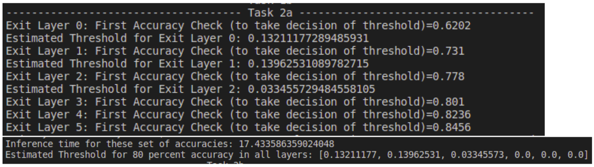
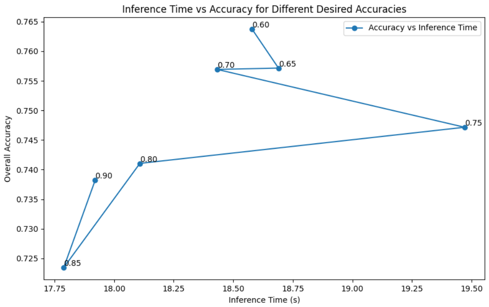

## Dynamic-Network-Inference
This repository contains code for implementing an Entropy-Based Early Exit method on a pre-trained BrancyNet model trained on CIFAR-10 data. The goal is to test the performance of early exit decisions based on entropy at different layers of the neural network.

## Network Architecture 


## Results

I calculated the accuracy and inference time for each layer at c=0.6. After that is done, overall accuracy and total inference time is taken as output from cutoff exit performance check function.

<table>
  <tr>
      <td align = "center">  </td>
  </tr>
  <tr>
      <td align = "center"> Overall Accuracy and Total Inference Time </td>
  </tr>
</table>

As we can observe, there is a tradeoff between overall accuracy and total inference time, and both have inverse correlation. So, we need to decide on our application that we need to give importance to accuracy or inference time and then need to decide the threshold value accordingly. We want the overall accuracy to be more and inference time to be less, so I designed a metric that is a ratio of overall accuracyand total time. We can calculate this metric for all overall accuracy and total time points which we have and then check for which point we get this metric to be maximum and thus, we can select the best threshold.

<table>
  <tr>
      <td align = "center">  </td>
  </tr>
  <tr>
      <td align = "center"> Analysis to select Best Threshold </td>
  </tr>
</table>

I have set the desired accuracy to 80%. After that, I estimated the threshold for each exit layer. For the first 3, I got some value of threshold, but for the last 3, accuracy was more than 80% for most of the samples (almost all the samples) and hence, we got the value of threshold as 0.0. As you can see from the result, my code tried to update the threshold value for the first 3 layers and tried making it 80%. For this, I used the top 20% entropies and tried building a relation of entropy with desired accuracy. The results can be better if we get a more accurate relation to
calculate this threshold.

<table>
  <tr>
      <td align = "center">  </td>
  </tr>
  <tr>
      <td align = "center"> Estimated Thresholds and Total Inference Time for that </td>
  </tr>
</table>

I have considered varying the 7 accuracy values [0.6, 0.65, 0.7, 0.75, 0.8, 0.85, 0.9] and overall accuracy is plotted against inference time. In my plot, we can infer about the relationship between overall accuracy and inference time.

<table>
  <tr>
      <td align = "center">  </td>
  </tr>
  <tr>
      <td align = "center"> Relationship between Overall Accuracy and Inference Time </td>
  </tr>
</table>

Final Test accuracy received is 73.81% and Test inference time is 17.64 seconds.

## Run Instructions
```
python3 Early_Exit.py
```
