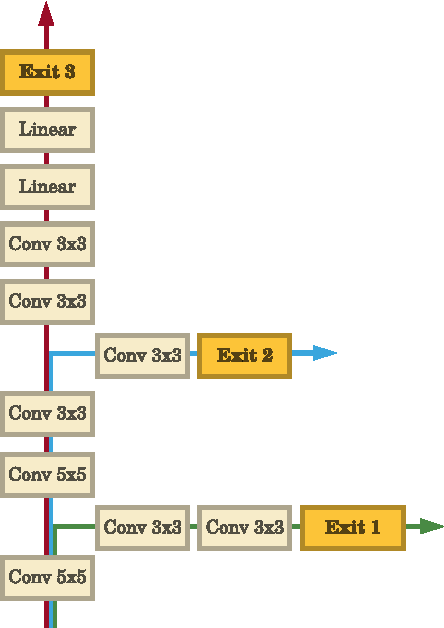
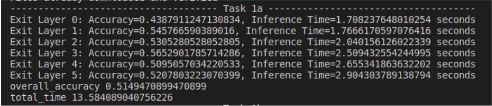
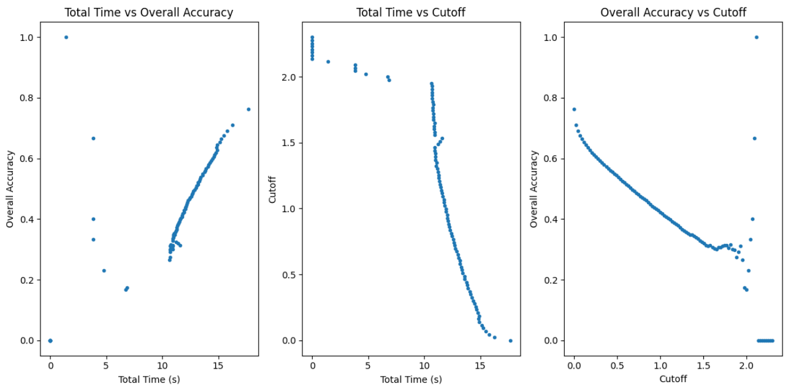

## Dynamic-Network-Inference
This repository contains code for implementing an Entropy-Based Early Exit method on a pre-trained BrancyNet model trained on CIFAR-10 data. The goal is to test the performance of early exit decisions based on entropy at different layers of the neural network.

## Network Architecture 


## Results

<table>
  <tr>
      <td align = "center">  </td>
  </tr>
  <tr>
      <td align = "center"> Overall Accuracy and Total Inference Time </td>
  </tr>
</table>

<table>
  <tr>
      <td align = "center">  </td>
  </tr>
  <tr>
      <td align = "center"> Analysis to select Best Threshold </td>
  </tr>
</table>

## Run Instructions
```
python3 Early_Exit.py
```
